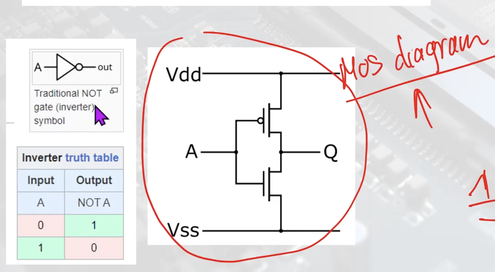
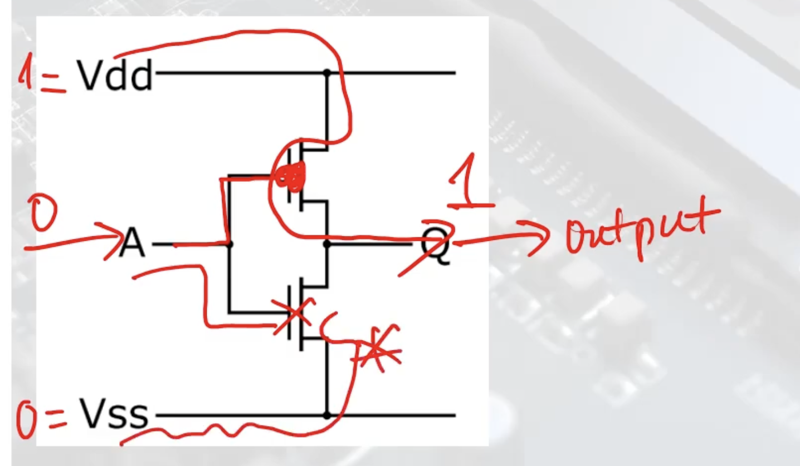
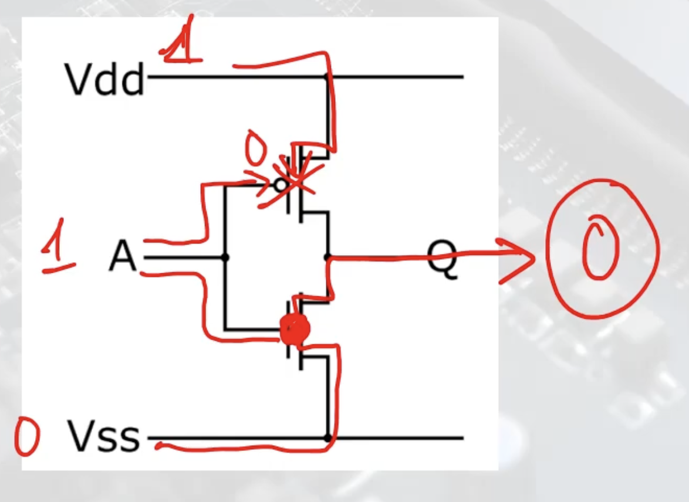
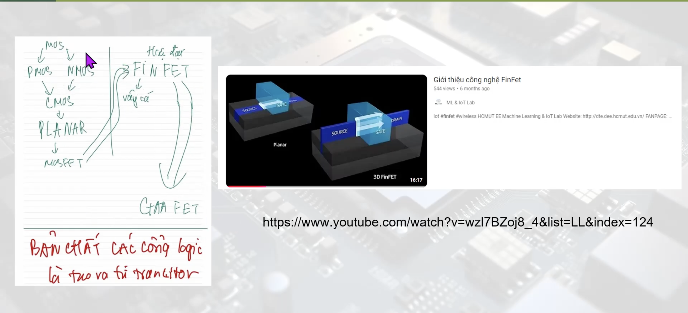

# Bài 2_1: Transistor_PMOS_NMOS_Hệ thống số là gì_Cấu trúc máy tính
## Giới thiệu hệ thống số
$$\text{Giá trị} = \text{Số}\times\text{Cơ số}^{Mũ}$$
### Hệ thập phân (Decimal) - Cơ số 10
* Đặc điểm: Sử dụng 10 chữ số: 0, 1, 2, 3, 4, 5, 6, 7, 8, 9.
* Ứng dụng: Là hệ thống số tự nhiên con người sử dụng để biểu diễn giá trị.
* Cách biểu diễn: $$345 = 3\times10^2 + 4\times10^1 + 5\times10^0$$

### Hệ nhị phân (Binary) - Cơ số 2:
* Đặc điểm: Chỉ sử dụng 0 và 1.
* Ứng dụng: Là hệ thống cơ bản của máy tính và các thiết bị kỹ thuật số vì chúng dễ dàng được biểu diễn bằng trạng thái điện áp cao (1) và thấp (0).
* Ví dụ:
$$1011_2 = 1\times2^3 + 0\times2^2 + 1\times2^1 + 1\times2^0 = 8+0+2+1 = 11_{10}$$
* Chuyển đổi: Hệ nhị phân có thể chuyển sang hệ thập phân và ngược lại.

### Hệ bát phân (Octal) - Cơ số 8
*   Đặc điểm: Sử dụng 8 chữ số: 0, 1, 2, 3, 4, 5, 6, 7.
*   Ứng dụng: Được sử dụng trong lập trình biểu diễn các nhóm 3 bit nhị phân, giúp rút gọn dữ liệu.
*   Ví dụ:
$$75_8 = 7\times8^1 + 5\times8^0 = 61_{10}$$
*   Chuyển đổi:
    + Từ **nhị phân** sang **bát phân**: Nhóm 3 bit thành một nhóm.
    + Từ **bát phân** sang **nhị phân**: Mỗi chữ số bát phân được biễu diễn bằng 3 bit
### Hệ thập lục phân (Hexadecimal) - Cơ số 16
*   Đặc điểm: sử dụng 16 **ký tự** 0, 1, 2, 3, 4, 5, 6, 7, 8, 9, A, B, C, D, E, F.
*   Ứng dụng: Sử dụng trong lập trình và thiết kế mạch để rút gọn dữ liệu nhị phân thành nhóm 4 bit.
*   Ví dụ:
$$2F_{16} =2\times16^1+15\times16^0 = 47_{10}$$
*   Chuyển đổi:
    + Từ **nhị phân** sang **thập lục phân**: Nhóm 4 bit thành 1 nhóm
    + Từ **thập lục** sang **nhị Phân**: Mỗi chữ số hex được biểu diễn bằng 4 bit.
>Hệ 8 sẽ không được sử dụng nhiều
>Hệ 16 mục đích để rút gọn cách biểu diễn từ hệ 2
## Kỷ nguyên số - máy tính - chip

**Tóm tắt**
Sơ khai là bảng tính (bảng tính Trung Quốc)
Tiếp theo là Kiến trúc von Neumann
## Transistor

Đại diện 2 giá trị 0 và 1 (*Hệ nhị phân*)
Có 2 loại là PMOS và NMOS

>PMOS có vòng tròn nhỏ ở cực (gate)

1 => đúng, cao, tín hiệu thông qua
chấm (o) đảo nghịch lại.
0 => hở, không được truyền.

**A := input : 1 hoặc 0**
**Q:= output : 1 hoặc 0**
trên (có o): PMOS
dưới: CMOS
vdd: tín hiệu mức cao (1)
vss: tín hiệu nối đất (0)

**Cách hoạt động**

>Cổng logic NOT được biểu diễn bằng transistor như thế nào.
* Nếu A := 0, gặp cổng đảo, vdd đi, output: 1
    
* Nếu A := 1, ngược lại, output Q:= 0
  

***Các cổng logic được tạo ra từ transistor***

### Bit, byte là gì?
### Bit (Binary digit):
* **Định nghĩa:** Bit là đơn vị nhỏ nhất của dữ liệu trong máy tính, biểu diễn một giá trị nhị phân là 0 hoăc 1.
* **Ứng dụng:** Bit được sử dụng để biểu diễn trạng thái logic, tín hiệu bật/tắt (on/off), hoặc các mức điện áp thấp/cao trong thiết bị điện tử.
* **Kí hiệu:** b (chữ thường).
* **Ví dụ**
  * Một bit có thể là 0 (tắt) hoặc 1 (bật).
  * Trong truyền thông, tốc độ mạng thường được đo bằng bps (bits per second).
### Byte:
* **Định nghĩa:** Byte là một tập hợp của 8 bit, được sử dụng làm đơn vị cơ bản để lưu trữ dữ liệu trong máy tính.
* **Ứng dụng:** Byte thường biểu diễn một kí tự (như chữ cái, số hoặc kí tự đặc biệt) trong mã hoá như **ASCII** hoặc **UTF-8**.
* **Ký hiệu:** B (chữ hoa)
* **Ví dụ**
    * 1 byte có thể lưu trữ một ký tự, ví dụ: A, 1, hoặc @.
    * Dung lượng lưu trữ máy tính thường được đo bằng byte, như kilobyte (KB), megabyte (MB), gigabyte (GB).
>Mối liên hệ giữa bit và byte:
1 Byte = 8 bit
Ví dụ:
> * Một số nhị phân 8-bit: 11001010 tương đương 1 byte.
> * Một file text 1 KB chứa khoảng 1024 kí tự, tương đương 8192 bit.

## CHUYỂN ĐỔI CÁC HỆ THỐNG SỐ.
### Hệ 2, 8, 16 sang hệ 10
>$$\text{Giá trị} = \text{Số}\times\text{Cơ số}^{Mũ}$$
 
Ví dụ:
* **2 sang 10**

$$10110,011_2 = 1\times2^4+0\times2^3+1\times2^2+1\times2^1+0\times2^0+0\times2^{-1}+1\times2^{-2}+1\times2^{-3}$$
$$=16+4+2+0,25+0,125 = 22,375_{10}$$
* **16 sang 10**
$$BA,4_{16} = 11\times16^1+10\times16^0+4\times16^{-1} = 176 + 10 +0,25 = 186,25_{10}$$
### Hệ 10 sang hệ 2, 8 ,16.
>Chia cho cơ số của hệ đó

### Hệ 2 sang 8 hoặc 16.
>8: gom 3 bit.
>16: gom 4 bit.

